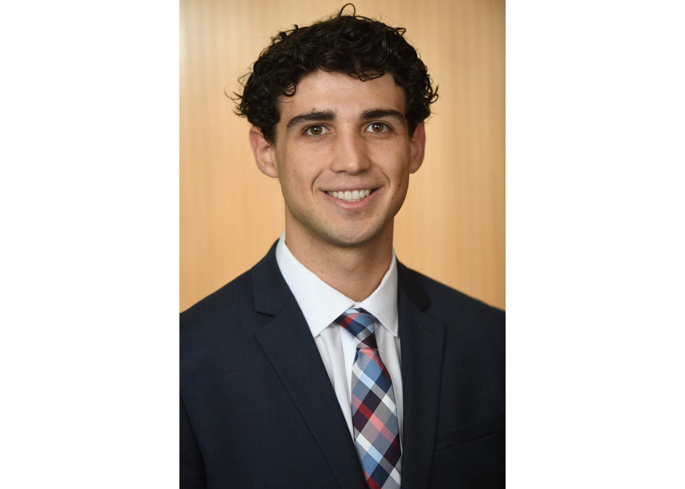

# About Us {-}

## Team 3: We Also Hate Python (aka MJJJJ) {-}

```{r pic-team, echo=FALSE, out.width="100%"}
knitr::include_graphics("pictures/about_us/team_pic.jpeg")
```

## Madison Hartle {-}

I am a recent graduate from the University of Michigan where I earned a bachelor's degree in Actuarial Mathematics. Currently, I am pursuing a masters degree in Business Analytics.

### General Information {-}

Here is a list of things that I enjoy:

- Long walks in the Arb
- Traveling 
- Spending time with friends and family
- Reading novels
- Writing poetry
- Eating ice cream

### Some things you probably didn't know {-}

1. My birthday is February 7th, 2000
2. I've been bungee jumping twice
3. I'm a math major but I didn't learn how to long divide until I was in college
4. The Mackinac Bridge is 500 feet high and 5 miles long


```{r pic-Mattie, echo=FALSE, out.width="50%", fig.cap="A break from skiing."}
knitr::include_graphics("pictures/about_us/Mattie.jpeg")
```

## Jenny (Yajie) Xu {-}
### Basic Information {-}
**First Name**: Yajie

**Last Name**: Xu

**Preferred Name**: Jenny

**Age**: 22

**Birthday**: 04/03/2000

**School**: Ross School of Business

**Field of Study**: MBAn

**Favorite Coding Language**: R

```{r pic-Jenny, echo=FALSE, out.width = '30%'}
knitr::include_graphics("pictures/about_us/Jenny.jpeg")
```


## John Oraa {-}

```{r pic-John, echo=FALSE, out.width="80%", fig.cap="John Oraa MBAn Class of 2023."}

```

### My Life {-}

Hello! My name is John. I am a 22 year old from a small town in Michigan called Fenton. Recently, I just graduated from the University of Michigan with my B.S.E in Mechanical Engineering. I recently began my masters at the Ross School of Business studying Business Analytics. 

My goal is to combine my technical undergraduate skills and master degree to focus my efforts on improving the business of healthcare. 

### My Accomlishments {-}

#### Project Teams {-}

In my undergrad I was apart of a couple different design teams focusing on engineering and consulting our customer

 - Medlaunch which focused on developing a need based issue in our community through consulting with our community partner
 - STARX which is the exoskeleton project engineering team developing an exoskeleton to be used in assisting Parkinsons patients


#### Professional Experience {-}

- Research: I have conducted research in human walking gait identification, parkinson's patients foot fall detection, mesh morphing.

- Engineering Design Internship

- Commercial Sale/Business Analytics Experience 


## Jason (Xiaodi) Pan {-}
### Background {-}

Hey everyone, my name is Xiaodi Pan and people usually call me Jason.
  
I was born and raised in Shanghai, China and I came to the U.S in 2016 for high school. I graduated from Penn State University in Spring 2022 with a major in Supply Chain Management and a minor in Information System Management. I am currently a Master's of Business Analytic student at University of Michigan Ross School of Business.
  

[Learn more about me professionally through Linkedin!](https://www.linkedin.com/in/xiaodi-jason-pan/)

I am actively looking for job opportunities in consulting, finance, supply chain and all other related areas in business. I'd love to own a consulting firm that focuses on innovative supply chain solutions for companies in the industry one day.

```{r pic-Jason, echo=FALSE, out.width="50%", fig.cap="Just me and my friend reflecting on life and Yes I was the one wearing shorts"}
knitr::include_graphics("pictures/about_us/Jason.jpeg")
```

### Fun Facts!!! {-}
* I speak fluent Shanghainese and learned Spanish for 3 years
* I am a basketball and soccer fan and my favorite teams are Golden State Warriors and Manchester United
* I spend a lot of my spare time watching movies and TV shows. My favourite TV show of all time is _Prison Break_
* I love racing. I drive a 6 Speed 2021 Booster Blue Honda Civic Type R and I also like to sim-race when I'm free
* Formula 1 is one of my favorite sports and I root for Daniel Riccardo and Charles Leclerc
* I co-own a company called _Lorna Kicks_ and we source fashion sneakers, street wears and electronics for clients

```{r pic-Jason-car, echo=FALSE, out.width="50%", fig.cap="My baby :) "}
knitr::include_graphics("pictures/about_us/Jason_car.jpeg")
```


*******


### Contact me here {-}

* Phone: 8143251314
* Email: email_me_already@lalorna.com     (Yes, I can actually read your email here)
* Discord: PARK0000#2587


## Jeremy (Junli) Zhou {-}

```{r, echo=FALSE, out.width="30%", fig.cap="me chilling on the beach"}
knitr::include_graphics("pictures/about_us/Jeremy.jpeg")
```

### Background {-}
I was born in Chongqing, a mountainous city in China that's also famous for cyperpunk-like buildings, numbing Szechuan cuisine and spicy hotpot (Yes I love my hometown!). I moved to Beijing with my parents since 10 and live there now. I came to study in the U.S. since 2013, spent 2 years of high school in Vermont, and stayed in New York for 6 years. 

I went to New York University for undergrad and graduated with a major in Computer Science and minor in Business Studies. Through various experiences I had developed an interest in data analytics and decided to pivot to data science while developing my business sense.

Now, I am a Master student at Ross School of Business, University of Michigan, studying Business Analytics. I hope to work as a Data Scientist or Data Analyst at an impact-driven tech company after this graduate program and become a Product Manager in 2-3 years.

### Favorite Quote {-}
> "It's always better to light up a candle than curse the darkness." Confucius

### Hobbies {-}
* Weight training
* Basketball
* Running
* Cooking
* Boxing
* Reading
* Movies
* Photography
* Snowboarding
* Wine & Whiskey tasting

### Fun Fact {-}
* Did sailing in high school
* Was a part of a dragon dance team
* Breakfast is my favorite meal of the day. Just can't live without eggs
* Try to meditate 5 minutes at least every day